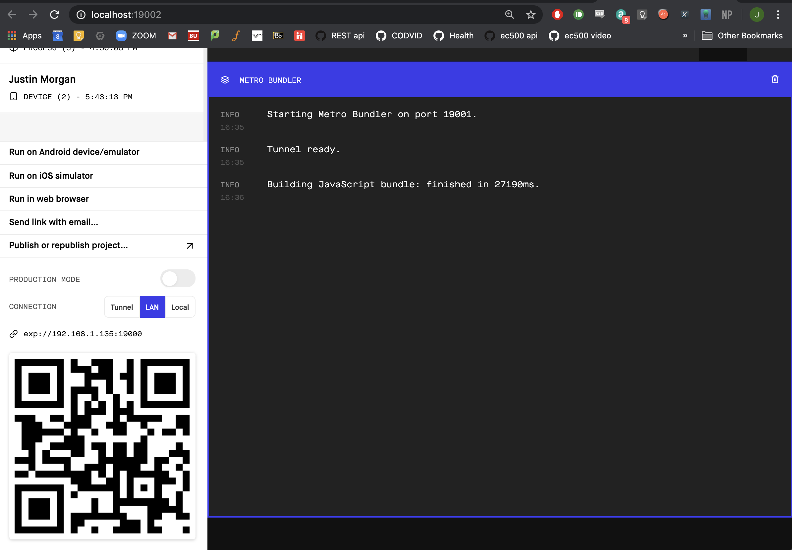
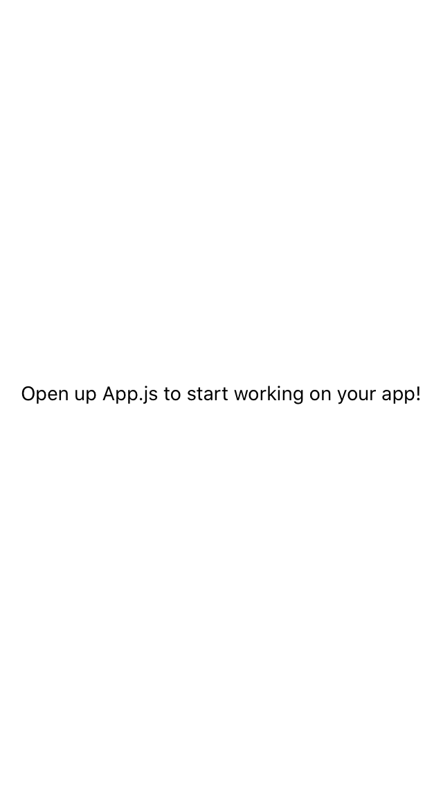
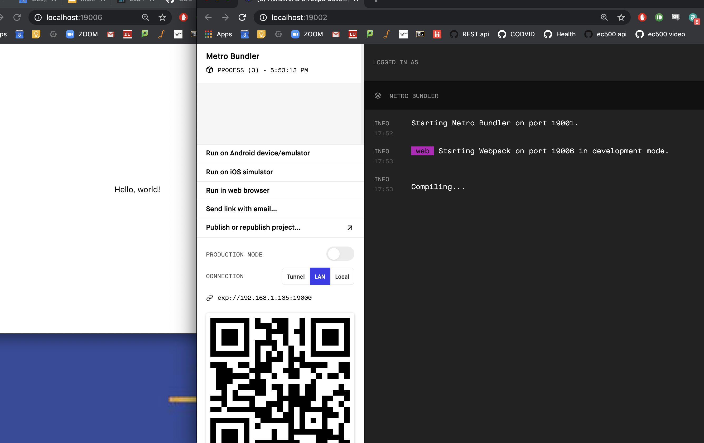
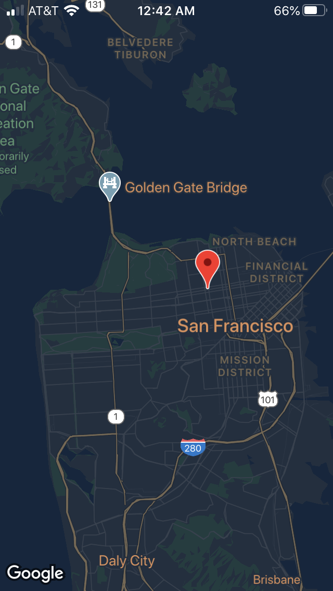
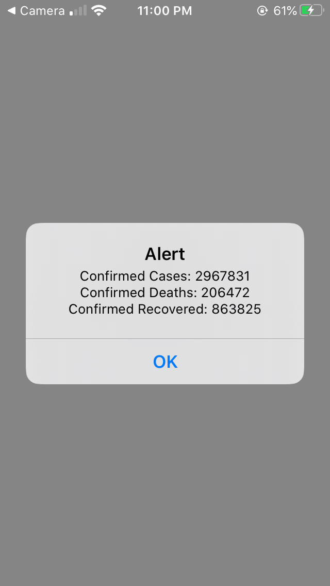
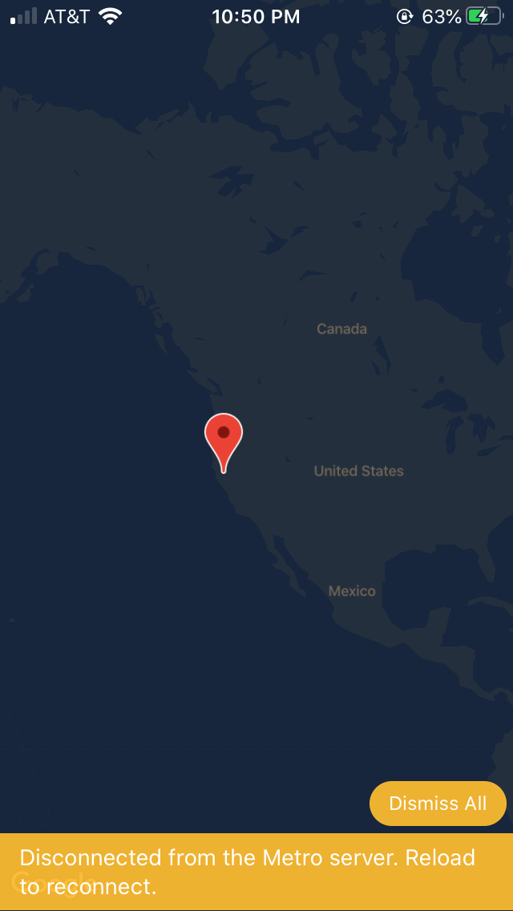
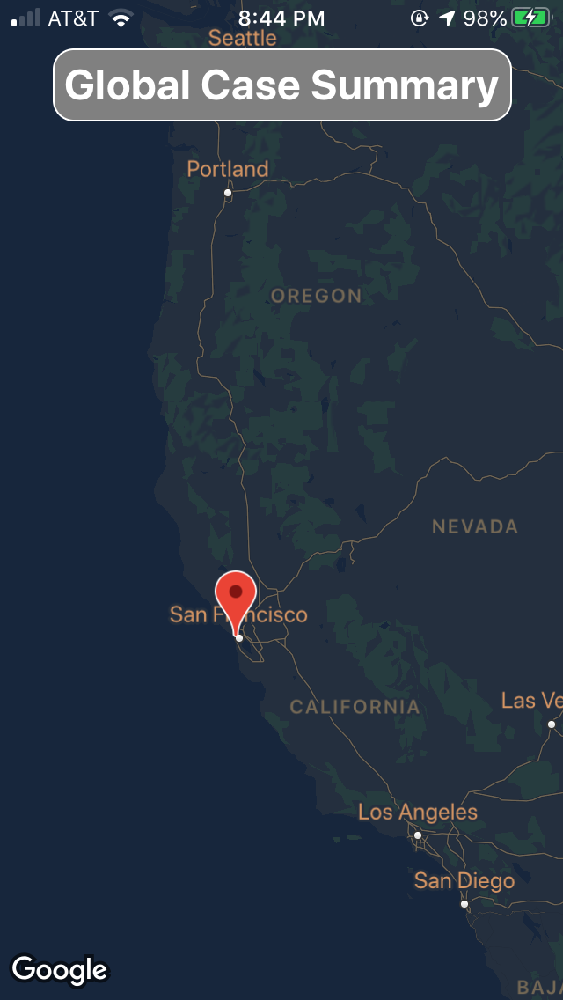
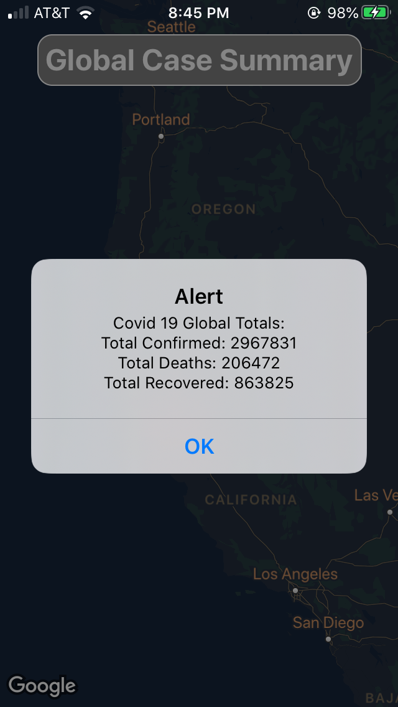

# codvid-app-justinfmorgan
codvid-app-justinfmorgan created by GitHub Classroom

# How Does it Work?
After downloading the Expo app and cloning the repo, navigate to the covid-app-final directory and run "expo start" in the terminal (assuming you have react native/expo installed on your computer). Then, scan the QR code that shows up in the web browser builder with your iOS device in order to load up the app. Allow the app to get your location, and then drag the marker to any country to see that country's covid-19 tallies via an alert. Tapping the global summary button at the top of the screen will display the world covid-19 totals.

# Step 1 Documentation
Setting up the web environment
 

 
Scanned the QR code and open app in mobile
 

# Step 2 Documentation
Hello World
 

 

# Step 3 Documentation
Displaying a marker on a map
 

 

# Step 4 Documenation
Displaying Covid data within the app via an alert.
 

 

# Step 5 Documentation (So far)
Displaying total confirmed cases using an alert upon completing dragging of marker to a country on the map.
 

 

 
Displaying more data per country
 

 
Implemented global summary button for displaying world totals.
 

 

